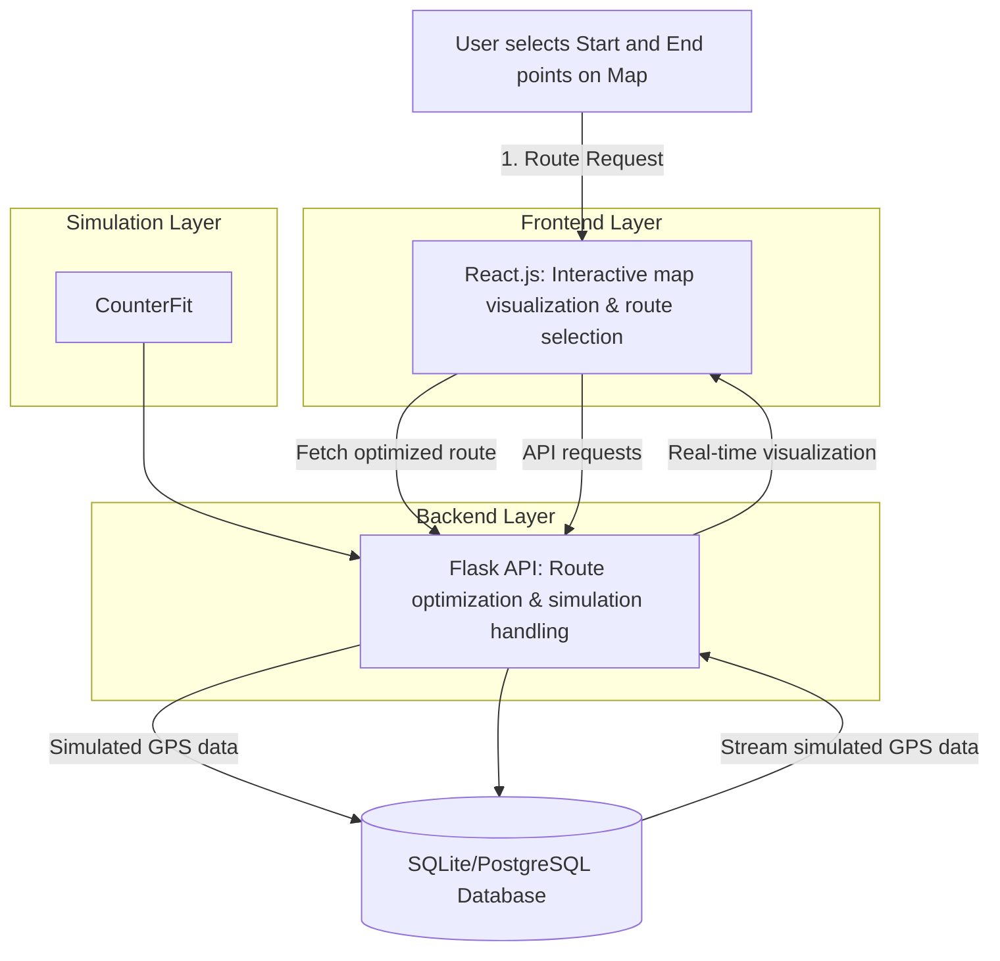

# IoT Real-Time Route Optimization Project

## Project Overview
This project involves developing a web-based application focused on real-time route optimization and simulated tracking for efficient asset management. The main goal is to allow organizations to simulate, analyze, and optimize routes between locations considering real-time traffic and travel conditions without relying on physical hardware.

---

## Specific Problem Addressed

### Problem Statement
Organizations frequently encounter challenges optimizing asset routes and logistics planning due to fluctuating traffic conditions and costly GPS hardware requirements, especially in areas with limited GPS or connectivity.

### How the Project Solves the Problem
This project addresses these challenges by:
- Simulating real-time asset movements along optimized routes without needing physical hardware.
- Providing real-time visualizations and analyses of potential routes to enhance operational decision-making.
- Reducing costs and improving efficiency by identifying optimal routes in simulated environments.

---

## Technology Stack

### Backend

- **Python (3.9.1)**: Core backend programming language.
- **Flask (2.1.2)**: RESTful API framework.
- **CounterFit**: Virtual IoT simulator generating GPS-like data.
- **SQLite or PostgreSQL**: Database for route data storage and analysis.

### Frontend

- **React.js**: User interface development.
- **Leaflet.js**: Real-time interactive map visualization.
- **Axios**: API communication.

### Hosting & Deployment

- **Netlify**: Frontend hosting.
- **Heroku (or similar)**: Backend hosting.

---

## System Architecture



---

## Example Workflow

- **Step 1:** User selects two points (Start: Warehouse X, End: Delivery Point Z).
- **Step 2:** Backend calculates optimized route using real-time traffic data.
- **Step 3:** CounterFit simulates real-time GPS tracking along optimized route.
- **Step 4:** Real-time tracking visualization displayed on frontend.
- **Step 5:** Historical route data stored and analyzed for future optimizations.

---

## Virtual Environment (`venv`) Setup

### 1. Create & Activate Environment
```bash
python3.9 -m venv venv
source venv/bin/activate
```

### 2. Install Packages
```bash
pip install -r requirements.txt
```
If `requirements.txt` isn't available:
```bash
pip install counterfit==0.1.4.dev9 Flask==2.1.2 Werkzeug==2.0.3 requests==2.32.3
```

### 3. Save Dependencies
```bash
pip freeze > requirements.txt
```

### 4. Run the Simulation
Start CounterFit:
```bash
counterfit
```
Then in another terminal:
```bash
python app.py
```

---

## SSH Configuration for GitHub Repository

### **1. Check Existing SSH Key**
```bash
ls ~/.ssh/id_rsa.pub
```

### **2. Generate SSH Key (if none exists)**
```bash
ssh-keygen -t rsa -b 4096 -C "your-email@example.com"
```

### **3. Add Key to GitHub**
- Copy key:
  ```bash
  cat ~/.ssh/id_rsa.pub
  ```
- Add key to [GitHub SSH Settings](https://github.com/settings/keys).

### **3. Test Connection**
```bash
ssh -T git@github.com
```

### **4. Configure Repository**
```bash
cd ~/iot-location-tracking
git remote set-url origin git@github.com:Minhcardanian/iot-location-tracking.git
```

### **5. Push Changes**
```bash
git add .
git commit -m "Configured SSH for GitHub"
git push origin main
```

---

## Future Enhancements

- Predictive analytics for traffic and route forecasting.
- Enhanced offline capabilities.
- Cloud database integration (PostgreSQL/PostGIS).

---

