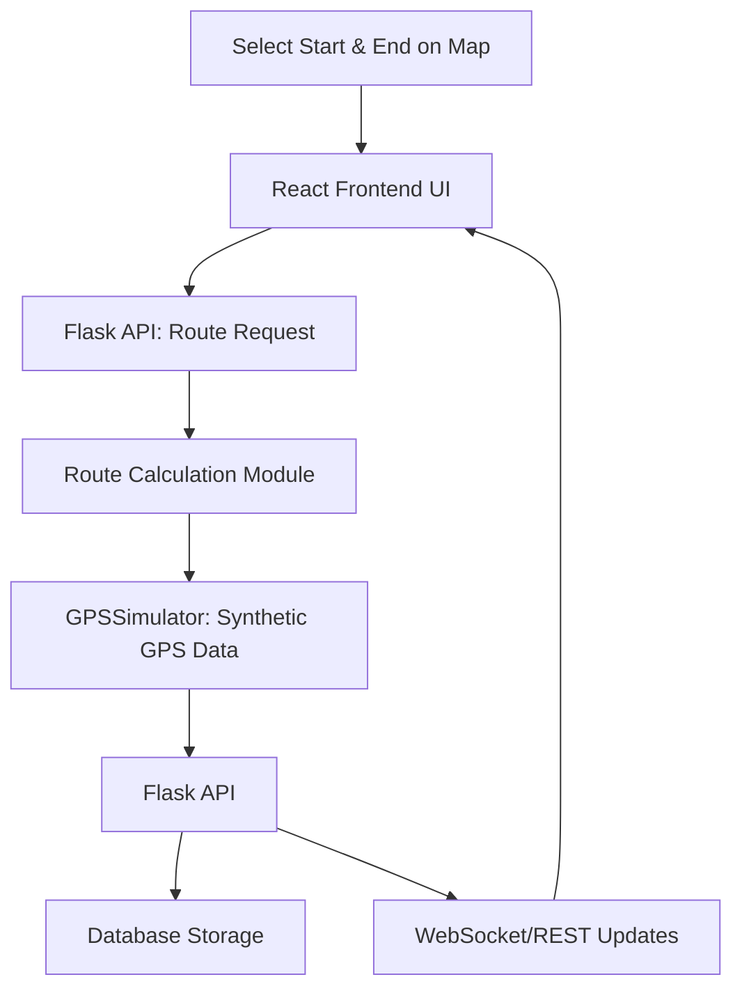
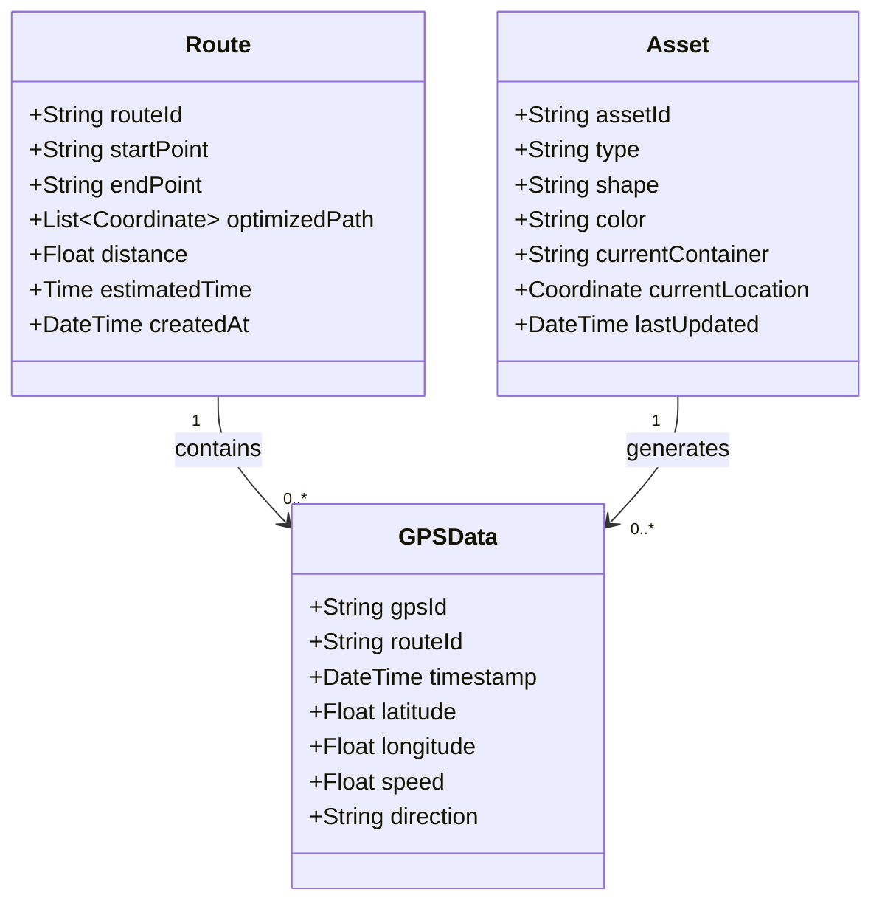

# IoT Real-Time Route Simulation & Synthetic Data Generation Project

## Project Overview
This project develops a web-based simulation environment for real-time route planning and synthetic GPS data generation, enabling asset management and routing analysis without physical hardware.

---

## Specific Problem Addressed

### Problem Statement
Organizations face difficulties validating logistics routes due to high costs, hardware constraints, and unpredictable real-world conditions.

### Project Solution
- Generates synthetic GPS data to simulate asset movement.
- Provides real-time visualization for strategy evaluation.
- Reduces costs and facilitates routing strategy experiments virtually.

---

## Technology Stack

### Backend
- **Python (3.9.1)**
- **Flask (2.1.2)**
- **GPSSimulator** *(optimized synthetic GPS data library instead of CounterFit)*
- **SQLite/PostgreSQL**

### Frontend
- **React.js**
- **Leaflet.js**
- **Axios**

### Hosting
- **Netlify** (Frontend)
- **Heroku** (Backend)

---

## Workflow & System Architecture



---

## Database Schema & Object Properties



---

## Virtual Environment (`venv`) Setup

```bash
python3.9 -m venv venv
source venv/bin/activate
pip install -r requirements.txt
```
If no `requirements.txt`:
```bash
pip install GPSSimulator Flask==2.1.2 Werkzeug==2.0.3 requests==2.32.3
pip freeze > requirements.txt
```

### Running the Simulation
```bash
gpssimulator
```
In another terminal:
```bash
python app.py
```

---

## GitHub SSH Setup Guide

1. **Check SSH Key:**
```bash
ls ~/.ssh/id_rsa.pub
```

2. **Generate SSH Key (if not exists):**
```bash
ssh-keygen -t rsa -b 4096 -C "your-email@example.com"
```

3. **Add SSH Key to GitHub:**
```bash
cat ~/.ssh/id_rsa.pub
```
- Add this key to [GitHub SSH Settings](https://github.com/settings/keys).

4. **Test SSH Connection:**
```bash
ssh -T git@github.com
```

5. **Configure Repo:**
```bash
cd ~/iot-location-tracking
git remote set-url origin git@github.com:Minhcardanian/iot-location-tracking.git
```

6. **Push Updates:**
```bash
git add .
git commit -m "Configured SSH for GitHub"
git push origin main
```

---

## Future Enhancements

- Enhance realism of synthetic data.
- Implement advanced dynamic scenario simulations.
- Integrate scalable cloud databases (PostGIS).

